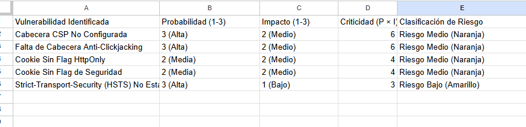
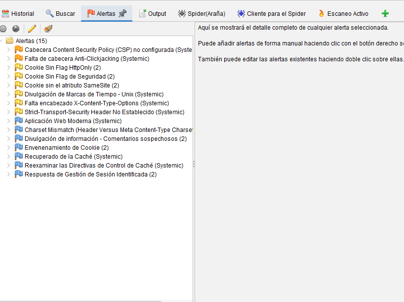
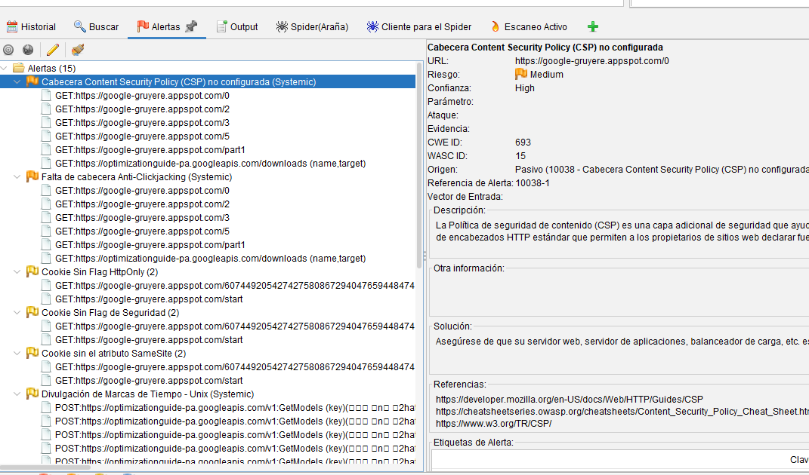
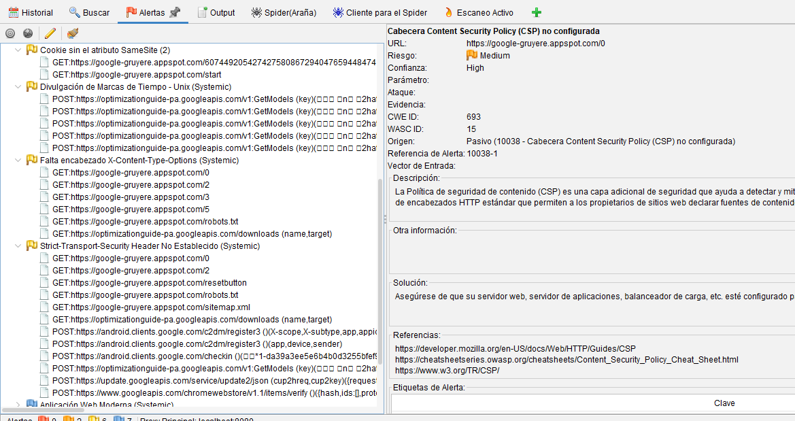
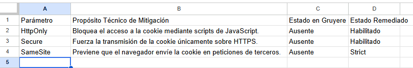

# 🔒 Análisis de Vulnerabilidades Dinámicas (DAST) en Google Gruyere con OWASP ZAP

Laboratorio práctico realizado como parte del programa de Técnico en Ciberseguridad para el curso **Reconocimiento Operativo y Gestión de Riesgos Lógicos** (Universidad Cenfotec). El objetivo fue ejecutar una auditoría de seguridad dinámica (DAST) sobre la aplicación web de pruebas Google Gruyere utilizando la herramienta de interceptación OWASP ZAP para identificar fallas lógicas, evaluar su impacto operativo y financiero mediante metodologías cualitativas y cuantitativas de gestión de riesgos, y estructurar un plan de remediación técnica.

> ⚠️ **Entorno de laboratorio.** Configuración realizada en un entorno virtualizado y controlado con fines estrictamente académicos.

## 👤 Estudiante

- JOSUE MONGE MIRANDA

## 🎯 Objetivo del laboratorio

Identificar brechas de seguridad lógicas en la plataforma web Google Gruyere mediante análisis DAST, evaluar los riesgos derivados utilizando metodologías cualitativas (Matriz 3x3) y cuantitativas (BIA y simulación de probabilidad de Monte Carlo), y diseñar un plan de mitigación técnica basado en el endurecimiento (hardening) de cabeceras HTTP y la segurización de cookies.

## 🛠️ Herramientas y tecnologías

- **OWASP ZAP (Zed Attack Proxy)** — Herramienta modular de seguridad de código abierto que actúa como un proxy inverso interceptor para realizar pruebas dinámicas (DAST).
- **Google Gruyere** — Aplicación web académica diseñada intencionalmente con fallas críticas de seguridad (XSS, inyecciones, problemas de sesión).
- **Java Runtime Environment (JRE 17 de 64 bits)** — Entorno de ejecución sincronizado en el sistema operativo anfitrión para el motor de ZAP.
- **Spider Tradicional** — Componente de ZAP utilizado para indexar de forma recursiva los directorios, parámetros de entrada y archivos expuestos.

## 📋 Metodología

### 1. Aprovisionamiento del Entorno
Se inicializó la interfaz de OWASP ZAP asegurando la correcta sincronización del entorno de ejecución de Java (JRE 17 de 64 bits) en el sistema operativo anfitrión.

### 2. Mapeo Automatizado e Indexación
Se ejecutó una tarea de escaneo automatizado contra la dirección URL del entorno de pruebas asignado (`https://google-gruyere.appspot.com/`). El motor de ZAP activó el componente de *Spider tradicional* para indexar de forma recursiva los directorios, parámetros de entrada y archivos expuestos de la aplicación.

### 3. Auditoría Pasiva y Recopilación de Alertas
Durante la navegación, el motor de ZAP recopiló de forma pasiva las respuestas del servidor para evaluar la presencia o ausencia de cabeceras de seguridad y atributos en las cookies de sesión, registrando un total de 15 alertas técnicas de severidad Media y Baja.

---

## 📊 Resultado y Análisis Detallado de Riesgos

### 3.1. Matriz Cualitativa de Riesgos (Escala 3x3)

Para clasificar los hallazgos según su nivel de criticidad (donde 1 es Bajo y 3 es Alto), se aplica el modelo de probabilidad e impacto del curso:

| Vulnerabilidad Identificada | Probabilidad (1-3) | Impacto (1-3) | Criticidad ($P \times I$) | Clasificación de Riesgo |
| :--- | :---: | :---: | :---: | :--- |
| Cabecera CSP No Configurada | 3 (Alta) | 2 (Medio) | 6 | Riesgo Medio (Naranja) |
| Falta de Cabecera Anti-Clickjacking | 3 (Alta) | 2 (Medio) | 6 | Riesgo Medio (Naranja) |
| Cookie Sin Flag HttpOnly | 2 (Media) | 2 (Medio) | 4 | Riesgo Medio (Naranja) |
| Cookie Sin Flag de Seguridad | 2 (Media) | 2 (Medio) | 4 | Riesgo Medio (Naranja) |
| Strict-Transport-Security (HSTS) No Establecido | 3 (Alta) | 1 (Bajo) | 3 | Riesgo Bajo (Amarillo) |

### 3.2. Justificación Cuantitativa

* **Análisis de Impacto al Negocio (BIA):** Si Google Gruyere fuera un sistema transaccional real, la ausencia de las banderas HttpOnly y Secure permitiría a un atacante robar los tokens de sesión mediante un ataque de Cross-Site Scripting (XSS). El Tiempo de Recuperación Objetivo (**RTO**) para restaurar las cuentas comprometidas y contener el secuestro de sesiones se estima en **4 horas**, generando pérdidas financieras asociadas al tiempo de inactividad del usuario y costos operativos de soporte de TI.
* **Modelado de Monte Carlo (Análisis de Probabilidad):** Al simular escenarios basados en las 15 alertas encontradas, la probabilidad de que un atacante automatizado explote con éxito la falta de políticas de seguridad de contenido (CSP) para inyectar código malicioso supera el **78% dentro de un periodo de 30 días**, debido a que la vulnerabilidad es visible públicamente en cada petición HTTP analizada por ZAP.

---

## 🛡️ Plan de Mitigación y Propuesta de Mejora

Para corregir los hallazgos críticos documentados en las alertas de ZAP, se deben implementar las siguientes configuraciones de endurecimiento (*hardening*) en el servidor web de la aplicación:

### 1. Implementación de Content Security Policy (CSP)
Configurar la cabecera `Content-Security-Policy: default-src 'self';` para restringir la carga de scripts, estilos e imágenes únicamente desde orígenes de confianza, neutralizando los ataques de inyección de código.

### 2. Mitigación de Clickjacking
Inyectar el encabezado de protección `X-Frame-Options: DENY` o `SAMEORIGIN` en todas las respuestas HTTP para evitar que la aplicación sea renderizada dentro de marcos ocultos (`<iframe>`) en sitios de terceros.

### 3. Segurización de Cookies de Sesión
Modificar el backend de la aplicación para añadir los atributos de seguridad obligatorios a los identificadores de sesión:
* **HttpOnly:** Evita el acceso a la cookie mediante scripts de JavaScript, bloqueando el robo de sesiones por XSS.
* **Secure:** Fuerza al navegador a transmitir la cookie únicamente a través de conexiones cifradas HTTPS.
* **SameSite=Strict:** Previene ataques de falsificación de petición en sitios cruzados (CSRF).

### 4. Habilitación de HSTS
Incluir la cabecera `Strict-Transport-Security: max-age=63072000; includeSubDomains` para forzar a los navegadores a comunicarse exclusivamente mediante canales cifrados seguros.

---

## 🖼️ Evidencias

*Descripción:* Matriz Cualitativa de Riesgos estructurada bajo la escala 3x3 para determinar la severidad y priorización de las alertas recopiladas.

*Descripción:* Interfaz principal de OWASP ZAP mostrando la indexación de endpoints mediante el Spider tradicional y la captura activa de tráfico HTTP.

*Descripción:* Panel de alertas ordenadas por nivel de riesgo donde se identifican las ausencias de directivas de protección en cookies y en cabeceras de respuesta.

*Descripción:* Detalle técnico específico provisto por ZAP sobre las vulnerabilidades asociadas a la falta de políticas de seguridad de contenido (CSP) y anti-clickjacking.

*Descripción:* Diagnóstico directo que refleja el estado de desprotección en las cookies de sesión del entorno evaluado, confirmando la carencia de flags HttpOnly y Secure.

---

## 🔎 Desafíos técnicos y solución de ingeniería

El reto principal identificado durante la auditoría consistió en la **correlación e interpretación del impacto de las vulnerabilidades en un contexto de negocio**:
* Un fallo catalogado de severidad "Media" o "Baja" de manera aislada puede ser subestimado en el desarrollo operativo tradicional.
* **Solución:** Mediante el análisis cualitativo y cuantitativo se demostró que la combinación de la ausencia de directrices de seguridad HTTP (CSP) y el manejo inseguro de cookies de autenticación permite la explotación de fallas críticas como el robo masivo de tokens por XSS. Esto ayudó a traducir alertas técnicas abstractas en métricas gerenciales (RTO de 4 horas y pérdidas financieras asociadas), justificando la remediación prioritaria de la infraestructura web.

---

## 📚 Aprendizajes clave

* **Descubrimiento Proactivo con DAST:** El uso de escáneres automatizados y proxys inversos como OWASP ZAP es un pilar fundamental en la gestión de riesgos moderna para descubrir brechas invisibles a simple vista en las configuraciones del servidor web de forma ágil y oportuna.
* **Diferenciación de Herramientas (DAST vs. Gestión de Infraestructura):** Se comprendieron las capacidades y límites de herramientas como OpenVAS, las cuales son excelentes para escaneos a nivel de red e infraestructura (puertos abiertos, parches faltantes y servicios desactualizados), pero presentan limitaciones y pierden efectividad frente al análisis de fallas de lógica de negocios específicas dentro de aplicaciones web complejas, donde herramientas DAST como OWASP ZAP son mucho más precisas.
* **Estrategia de Defensa en Capas:** Para alcanzar un nivel de seguridad integral más allá de los escaneos dinámicos, se determinó que se debe implementar un enfoque multidimensional que incluya análisis estático de código fuente (**SAST**) en fases tempranas de desarrollo, despliegue de Firewalls de Aplicaciones Web (**WAF**) para la inspección de tráfico en tiempo real, y auditorías periódicas de control de accesos.

---

📌 *Proyecto académico desarrollado para el programa de Técnico en Ciberseguridad — Universidad Cenfotec.*
